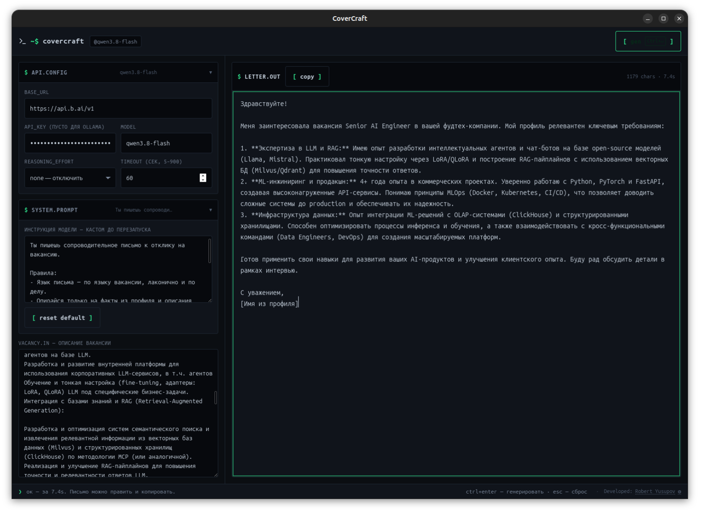

# CoverCraft

[](https://go.dev)
[](LICENSE)
[](https://goreportcard.com/report/github.com/turkprogrammer/covercraft)
[](https://github.com/turkprogrammer/covercraft/actions/workflows/ci.yml)

Генератор сопроводительных писем с **fit-оценкой на коде** (не LLM),
гиперперсонализацией из вашего профиля и open-source кодом под MIT.
Нативное окно (WebKit2GTK) + Go-бэкенд, один бинарник, настройки в
`~/.config/covercraft/settings.json`, контекст кандидата в `context/*.md`.

Автор: **Robert Yusupov** — [github.com/turkprogrammer](https://github.com/turkprogrammer) ·
[yusupov-tech.ru](https://yusupov-tech.ru/)

## Уникальные преимущества

| Преимущество | CoverCraft | Конкуренты |
|---|---|---|
| **Fit-оценка на коде, не на модели** | Вердикт `apply/skip/caveats` считает детерминированный матчер (`internal/fit`), ноль LLM-токенов по умолчанию | Rezi, Jobscan — оценка через LLM или эвристика |
| **Гиперперсонализация** | Письмо строится из вашего реального профиля (`context/*.md`), а не generic-шаблонов | Enhancv, Novoresume — шаблоны с автозаполнением |
| **Приватность** | Профиль и письма остаются локально; нет облака-посредника | TealHQ, Skillbuild — данные в их cloud |
| **Open-source + один бинарь** | Go-проект под MIT, `go build` даёт один файл, нет npm/yarn/pip | Большинство — SaaS или тяжёлые зависимости |
| **Два движка матчинга** | Детерминированный (0 токенов) и гибридный (LLM с цитатами + код-верификация) | Нет аналогов |

## Скриншоты



## Что нового в 0.2.2

- **Fit-вердикт без ложных «не откликаться»**: ограничитель в одной
  клаузе профиля («Transactional outbox на PostgreSQL: НЕ использовал»)
  больше не отменяет факты в других клаузах («PostgreSQL (глубокое
  знание)»). Раньше must-have «Опыт работы с SQL БД (Postgres)» уходил
  в missing и давал вердикт `skip`, хотя требование закрыто профилем.
- Отрицание стало клаузным, а не профилем целиком: глобальные вето
  («готов освоить X», «X, опыта нет») + клаузные ограничители; метка
  моста и заглавная «НЕ» фактами не считаются; честные пробелы
  (Python, Airflow, OpenTelemetry…) остаются пробелами.
- 168 unit-тестов (+7 стражей конвенций профиля). Полная история — в
  [CHANGELOG.md](CHANGELOG.md).

## Что нового в 0.2.1

- **Fit-fix — автоисправление по fit-caveats**: fit-движок нашёл факт в
  профиле, но модель не включила его в письмо? Кнопка `fit-fix (N)` в
  панели вердикта отправляет письмо и список недостающих фактов модели
  обратно: она дописывает их в существующие буллеты, не переписывая
  письмо. Цикл до 3 итераций с re-fit после каждой — завершается, как
  только исправимых оговорок не осталось.
- **Регресс-защита конвейера fit-fix**: интеграционный тест фиксирует,
  что факт «в профиле, но не в письме» действительно доезжает до списка
  исправимых оговорок; контракт SSE — поле `fitFixable` в ответе всегда
  присутствует (без `omitempty`), фронтенд различает «0 оговорок» и
  «нет данных».
- 163 unit-теста. Полная история — в [CHANGELOG.md](CHANGELOG.md).

## Как это работает

```text
┌────────────────────────────────┐
│  GTK-окно + WebKit2GTK 4.1     │  internal/window (CGO, ~50 строк)
│  frontend/index.html (embed)   │  terminal UI, vanilla JS
└──────────┬─────────────────────┘
           │ fetch() по относительным URL
┌──────────▼─────────────────────┐
│  HTTP на 127.0.0.1:случайный   │  internal/server
│  / · /api/settings · /api/generate
└──────┬──────────────┬──────────┘
       │              │
 ~/.config/…    context/*.md + LLM (OpenAI-совместимый API)
 settings.json  (Ollama / OpenAI / TokenRouter / Apinex / …)
```

- **UI**: один HTML-файл без бандлеров, терминальный стиль (тёмная тема по
  умолчанию, светлая через `prefers-color-scheme`), моноширинный шрифт.
  Ходит по относительным URL — порт в JS не нужен.
- **Настройки**: хранит Go, UI читает/пишет через `/api/settings`.
  LocalStorage не используется: случайный порт = новый origin при каждом
  запуске, настройки бы терялись.
- **Промпт**: `context/*.md` (профиль, проекты — всё, что `.md`, по алфавиту)
  + текст вакансии → единый user-промпт; системный промпт — из настроек.
- **Постпроверка письма (`internal/audit`)**: после генерации письмо
  автоматически проверяется на типовые сбои LLM — потерянные факты профиля
  (Yii2/Lumen/PHPUnit/Fraud Engine и метрики), запрещённое в строке стека
  (фреймворки, PHPUnit/PHPStan, non-tech термины), дубли технологий между
  буллетами и секцией пробелов, смещённую атрибуцию метрик (155+ тестов —
  Go-проект, а не PHPUnit), плейсхолдеры и названия ИИ-редакторов. Найденное
  показывается панелью «⚠ проверка письма» под результатом.
- **Автоправка (auto-fix)**: кнопка в панели замечаний отправляет письмо +
  список претензий + контекст кандидата обратно модели с правилами исправления
  по каждому типу замечания; исправленный текст проверяется повторно — цикл
  до нуля замечаний. Модель правит точечно по фактам профиля, а не пишет
  письмо заново.
- **LLM**: любой OpenAI-совместимый endpoint. Ollama работает без ключа.
- **Стриминг**: `/api/generate` отвечает Server-Sent Events — письмо печатается
  в `letter.out` по мере генерации модели (эффект «печатающей машинки»);
  в конце — событие с полным текстом, `elapsedMs` и предупреждениями аудита.
- **Счётчик времени**: `/api/generate` возвращает `elapsedMs` — UI показывает
  `N chars · X.Xs` рядом с письмом (сколько отвечала модель).

## Сравнение с решениями на рынке

| Инструмент | Fit-оценка | Гиперперсонализация | Open-source | Локальный деплой |
|---|---|---|---|---|
| **CoverCraft** | ✅ код | ✅ профиль | ✅ MIT | ✅ да |
| Rezi.ai | ❌ нет | ⚠ шаблон | ❌ нет | ❌ cloud |
| Jobscan | ✅ эвристика | ❌ низкая | ❌ нет | ❌ cloud |
| TealHQ | ❌ нет | ⚠ средняя | ❌ нет | ❌ cloud |
| ChatGPT/Cursor | ❌ нет | ✅ generic | ❌ нет | ⚠ self-host |

## Reasoning-модели (glm и другие)

Модели с «размышлениями» (z-ai/glm-5.x и т.п.) без настройки могут думать
минутами — письмо кажется «висящим», а потом приходит `context deadline
exceeded`. В панели `api.config` есть селект **reasoning_effort**:

- **none** — отключить размышления (рекомендуется для генерации писем);
- low / medium / high — управляемое усилие;
- «не отправлять» — параметр не уходит в запрос (для моделей и провайдеров
  без поддержки, например Ollama).

Замеры на реальном провайдере: glm-5.3-free без effort — 3355
reasoning-токенов и 6+ минут на письме; с `none` — в разы быстрее.
Таймауты: клиент 300 s, сервер 600 s — медленные модели успевают.

## Требования

- Ubuntu, Linux x86_64, GTK3, WebKit2GTK 4.1.
- Go 1.26+ для сборки.

```bash
# dev-заголовки для сборки (рантайм уже есть в Ubuntu 22.04+):
sudo apt install build-essential pkg-config libwebkit2gtk-4.1-dev
```

> `libwebkit2gtk-4.0` в Ubuntu 24.04+ больше нет — поэтому вендорить
> `webview/webview_go` нельзя, окно открывается собственной CGO-обвязкой
> поверх системного WebKit 4.1 (internal/window).

## Сборка

```bash
go build -o covercraft .
./covercraft
```

## Установка

Основной путь — готовый бинарник из [Releases](https://github.com/turkprogrammer/covercraft/releases):

```bash
tar xzf covercraft_0.2.2_linux_amd64.tar.gz
./covercraft
```

Для запуска достаточно рантайма `libwebkit2gtk-4.1-0` (есть в Ubuntu 24.04+).

Альтернатива — `go install` (компилирует на вашей машине, нужны dev-заголовки):

```bash
sudo apt install build-essential pkg-config libwebkit2gtk-4.1-dev
go install github.com/turkprogrammer/covercraft@latest
```

Бинарник окажется в `~/go/bin/`. Приложение ищет `context/*.md` рядом с
бинарником или в текущем каталоге — создайте `context/` там, где будете
запускать.

## Использование

1. Запустите. Откроется окно `~$ covercraft` в терминальном стиле.
2. В панели `api.config` укажите base URL провайдера (например
   `https://api.apinex.bond/v1` или `http://127.0.0.1:11434/v1` для
   Ollama), модель (например `free/gemini-3.8-flash`, `llama3.2`),
   ключ при необходимости, и reasoning_effort для reasoning-моделей.
3. В `system.prompt` — как писать письмо (уже есть разумный дефолт).
4. Вставьте вакансию в `vacancy.in`, нажмите `[ gen ]` или Ctrl+Enter.
5. Письмо появится в `letter.out` — счётчик покажет размер и время
   генерации (`N chars · X.Xs`); можно отредактировать и нажать `[ copy ]`.

Настройки сохраняются автоматически (после 400 мс тишины) и переживают
перезапуск. Esc очищает результат.

## Фит-панель и движки

После генерации письмо проверяется фит-матчером: требования вакансии
(разобранные моделью) сопоставляются с письмом и профилем, панель показывает
вердикт (`apply` / `apply_with_caveats` / `skip`), скор и расшифровку
закрыто / с оговоркой / не закрыто.

Движок задаётся полем `fitEngine` в `~/.config/covercraft/settings.json`:

- `""` / `"deterministic"` (по умолчанию) — матчер на правилах: токены,
  синонимы, отрицания, мосты, концепт-признаки. Ноль дополнительных
  LLM-вызовов, воспроизводим.
- `"llm"` — гибрид: модель размечает покрытие каждого must-have цитатами,
  код верифицирует цитаты и отрицания и считает вердикт. Один дополнительный
  LLM-вызов на генерацию; при ошибке модели, таймауте или битом JSON —
  автоматический откат на детерминированный матчер.

## Динамические концепты

Концептные требования (навыки, названные словами, а не технологиями —
«опыт интеграции с платёжными процессингами») матчатся по концептам:
триггер в формулировке требования + минимум два сигнала-факта в письме
или профиле.

- Из коробки работает встроенный набор концептов (`DefaultConcepts`).
- При `fitEngine: "llm"` концепты дополнительно генерируются моделью из
  вашего `context/*.md` (один LLM-вызов при первом `generate`) и кэшируются
  в `~/.config/covercraft/concepts.json` с SHA-256 хэшем профиля.
- Кэш инвалидруется автоматически при изменении профиля: хэш не совпал —
  перегенерация. Файл — обычный JSON (`name`, `trigger_terms`, `signals`),
  можно править вручную: правка работает, пока профиль не менялся.
- Нет валидного кэша и недоступна LLM (нет ключа, таймаут, битый JSON) —
  используется встроенный набор: поведение системы не деградирует.

## Структура

```text
main.go                  точка входа: сервер + окно
frontend/index.html     весь UI (embed)
internal/settings/      JSON-настройки, 0600, атомарная запись
internal/llm/           OpenAI-совместимый клиент /chat/completions,
                         reasoning_effort (omitempty), timeout 300s
internal/cover/          сборка user-промпта из context/*.md
internal/fit/            фит-матчер: извлечение требований, покрытия,
                         вердикт; concepts.go — динамические концепты
                         (LLM-генерация, кэш ~/.config/covercraft/concepts.json)
internal/server/         HTTP-роутер + швы LLMFunc/LLMStreamFunc для тестов,
                         /api/generate стримит SSE: дельты + done (letter,
                         elapsedMs, warnings)
internal/window/         CGO: GTK-окно + WebKit2GTK 4.1
internal/audit/          постпроверка письма: запрещённые паттерны,
                         потерянные факты, дубли, атрибуция метрик
context/                 user's context: *.md (gitignored, private)
```

Полный обзор для AI-агентов — [llms.txt](llms.txt).
Правила контрибуции — [CONTRIBUTING.md](CONTRIBUTING.md).

## API (для интеграции)

| Метод | Путь           | Что делает |
|-------|----------------|------------|
| GET   | `/`            | UI (HTML из embed) |
| GET   | `/api/settings`| текущие настройки |
| POST  | `/api/settings`| сохранить настройки |
| POST  | `/api/generate`| `{vacancy}` → SSE: `delta`…, `done {letter, elapsedMs, warnings}` |

## Тесты

```bash
go test ./...
```

Юнит-тесты на все пакеты: настройки (roundtrip, битый JSON, права 0600),
LLM-клиент (запрос/ответ/ошибки через httptest; reasoning_effort
отправляется только когда задан), сборка промпта, HTTP-эндпоинты
(включая 400/502 и elapsedMs), embed-фронтенд (копирайт, селект
reasoning effort), постпроверка писем (запрещённые паттерны, потерянные
факты, дубли, атрибуция метрик) и режим автоправки.

## Отладка

- Сервер печатает URL в stderr: `covercraft: http://127.0.0.1:PORT`.
- Логи запросов — там же (`GET /`, `POST /api/generate`).
- `GDK_BACKEND=x11 ./covercraft` — окно через Xwayland (удобно для
  скриншотов и xprop).

## Дистрибуция

Артефакты релиза собираются в `dist/` (не в git). В бинарник вшивается
версия модуля из тега git: собирайте после тега из чистого дерева
(иначе в `go version -m` уедет `+dirty`):

```bash
mkdir -p dist
go build -o covercraft .
tar czf dist/covercraft_0.2.2_linux_amd64.tar.gz covercraft README.md LICENSE
sha256sum dist/covercraft_0.2.2_linux_amd64.tar.gz \
  > dist/covercraft_0.2.2_linux_amd64.tar.gz.sha256
```

`context/` в архив не входит: он приватен и создаётся каждым
пользователем под себя. Dev-пакеты нужны только для сборки; для запуска
достаточно рантайма `libwebkit2gtk-4.1-0` (есть в Ubuntu 24.04+).

## License

MIT — см. [LICENSE](LICENSE).
